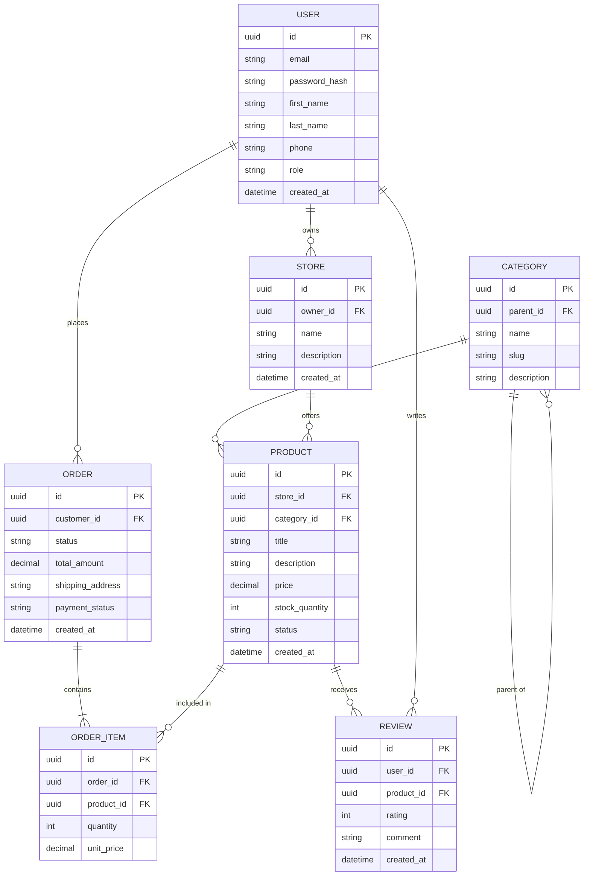

# Концептуальна модель даних маркетплейсу

## Опис системи
Система для організації мультивендорного маркетплейсу, що забезпечує взаємодію покупців, магазинів продавців, каталог товарів з ієрархічними категоріями, оформлення замовлень та систему відгуків.

## ER-діаграма (v2 - Нормалізована модель 3NF)

## Відповідність критеріям
- **Нормалізація 3NF:** Видалено динамічно обчислювані поля (`subtotal` та `rating`).
- **Історія цін:** Ціна за одиницю товару на момент купівлі зберігається в `ORDER_ITEM.unit_price`.
- **Іменування:** Усі сутності наведені до однини.