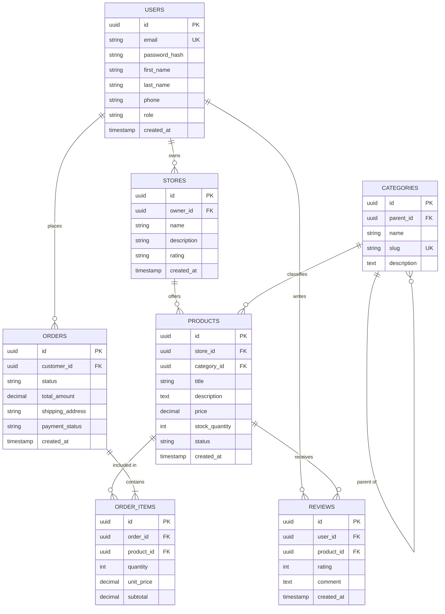

# Концептуальна модель даних маркетплейсу

## Домен
Система маркетплейсу для взаємодії покупців, продавців та оформлення замовлень товарів.

## Початкова ER-діаграма (Draft v1)

```mermaid
erDiagram
    USERS ||--o{ STORES : "owns"
    USERS ||--o{ ORDERS : "places"
    USERS ||--o{ REVIEWS : "writes"

    STORES ||--o{ PRODUCTS : "offers"

    CATEGORIES ||--o{ CATEGORIES : "parent of"
    CATEGORIES ||--o{ PRODUCTS : "classifies"

    PRODUCTS ||--o{ ORDER_ITEMS : "included in"
    PRODUCTS ||--o{ REVIEWS : "receives"

    ORDERS ||--|{ ORDER_ITEMS : "contains"

    USERS {
        uuid id PK
        string email UK
        string password_hash
        string first_name
        string last_name
        string phone
        string role
        timestamp created_at
    }

    STORES {
        uuid id PK
        uuid owner_id FK
        string name
        string description
        string rating
        timestamp created_at
    }

    CATEGORIES {
        uuid id PK
        uuid parent_id FK
        string name
        string slug UK
        text description
    }

    PRODUCTS {
        uuid id PK
        uuid store_id FK
        uuid category_id FK
        string title
        text description
        decimal price
        int stock_quantity
        string status
        timestamp created_at
    }

    ORDERS {
        uuid id PK
        uuid customer_id FK
        string status
        decimal total_amount
        string shipping_address
        string payment_status
        timestamp created_at
    }

    ORDER_ITEMS {
        uuid id PK
        uuid order_id FK
        uuid product_id FK
        int quantity
        decimal unit_price
        decimal subtotal
    }

    REVIEWS {
        uuid id PK
        uuid user_id FK
        uuid product_id FK
        int rating
        text comment
        timestamp created_at
    }
```