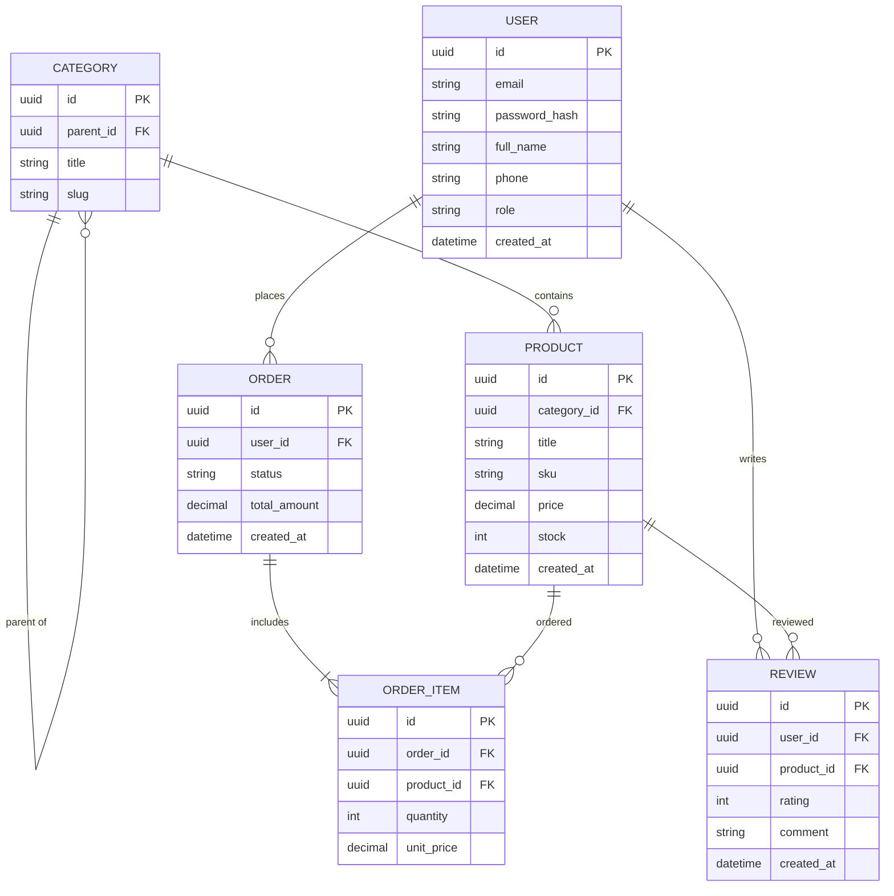
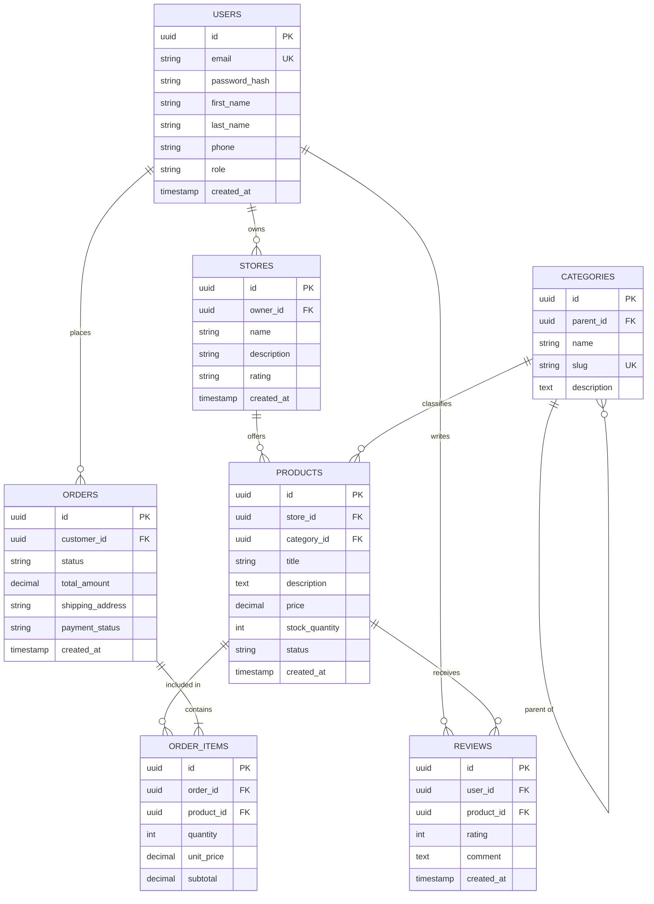
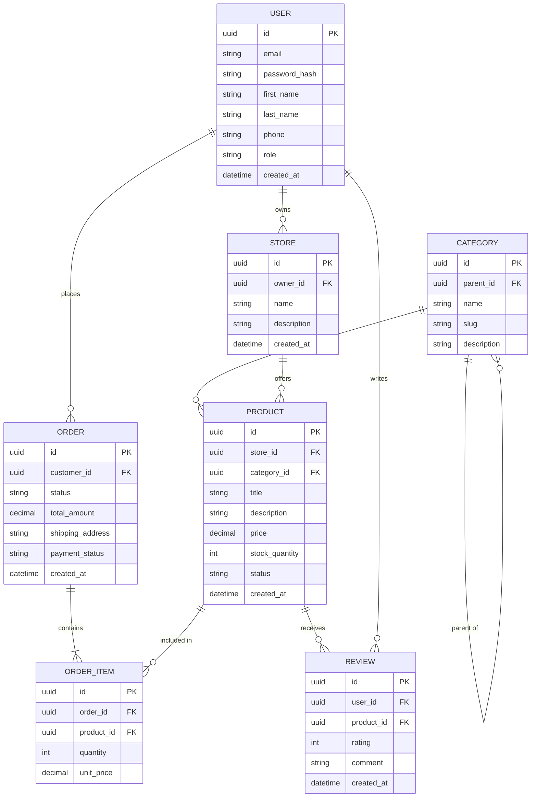
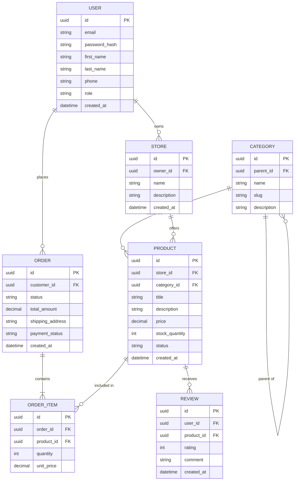

# Журнал взаємодії з AI (Prompt History)

## Ітерація 1: Початковий запит та базовий монолітний магазин
**Промт:**
> "Мені потрібно спроєктувати базу даних для онлайн-магазину на Mermaid. Зроби таблиці користувачів, категорій, товарів, замовлень і відгуків."

**Отриманий результат від AI:**

---

## Ітерація 2: Перехід до мультивендорності (Prom.ua)
**Промт:**
> "Ми змінюємо домен з простого магазину на мультивендорний маркетплейс (як Prom.ua). Потрібно додати підтримку магазинів (STORES), розбити ім'я користувача на first_name/last_name, додати доставку та оновити схему."

**Отриманий результат від AI:**

---

## Ітерація 3: Інженерний аудит студента та виявлення дефектів AI

**Зауваження та критика роботи моделі:**
1. **Порушення 3NF (аномалії надлишковості):** AI додав обчислюване поле `ORDER_ITEMS.subtotal` (`quantity * unit_price`) та динамічний агрегат `STORES.rating`. Це порушує 3-ю нормальну форму.
2. **Невідповідність конвенціям іменування:** Сутності згенеровані у множині (`USERS`, `STORES`, `PRODUCTS` замість `USER`, `STORE`, `PRODUCT`).
3. **Невалідний синтаксис типів:** Використано типи `text`, `timestamp` та непідтримуваний у Mermaid модифікатор `UK`.

**Коригувальний промт:**
> "Проведи нормалізацію до 3NF: видали subtotal та rating. Приведи сутності до однини, типи до string/datetime та прибери UK. Зафіксуй кардинальність замовлення як мінімум 1 позиція."

**Отриманий результат від AI:**

---

## Ітерація 4: Оптимізація Mermaid-топології (усунення перетинів ліній)

**Проблема рендерингу:** 
Зв'язок `USER -> REVIEW` перетинав усю схему зверху вниз, викликаючи зламаний автолейаут у GitHub.

**Коригувальний промт / Власноручне виправлення:**
> "Перегрупуй послідовність сутностей та зв'язків Mermaid зверху вниз (CATEGORY -> STORE -> USER -> PRODUCT -> ORDER -> ORDER_ITEM -> REVIEW), щоб лінії зв'язків не перетинали таблиці."

**Фінальна стабільна схема:**

---

## Ітерація 5: Формалізація архітектурних рішень (ADR)
**Промт:**
> "Сформуй пакет архітектурних записів рішень (ADR за стандартом MADR):
> 1. ADR 0001: Виділення сутності STORE для мультивендорності.
> 2. ADR 0002: Фіксація unit_price у позиціях замовлення як знімка ціни.
> 3. ADR 0003: Рекурсивний зв'язок категорій (parent_id)."

**Отриманий результат:**
Створено документацію в директорії `docs/adr/` (`0001-separate-store-entity.md`, `0002-price-snapshot-in-order-items.md`, `0003-hierarchical-categories-self-reference.md`).

---

## Ітерація 6: Підготовка документа захисту (DEFENSE.md)
**Промт:**
> "Згенеруй документ DEFENSE.md строго за структурою DoD: намір і критерії, топ-3 виправлення зі специфікацією, ключові архітектурні рішення та чекліст узгодженості."

**Отриманий результат:**
Створено фінальний артефакт `DEFENSE.md` для захисту лабораторної роботи.