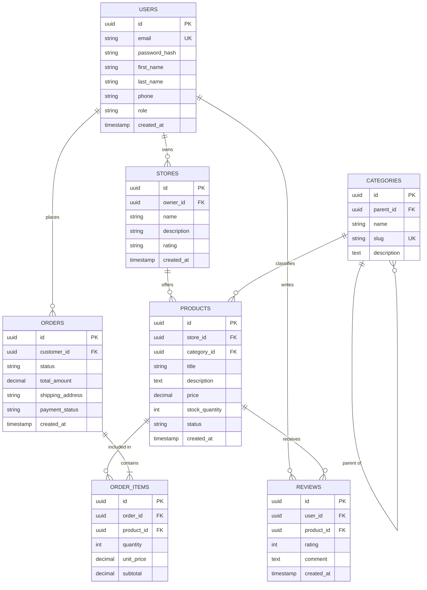
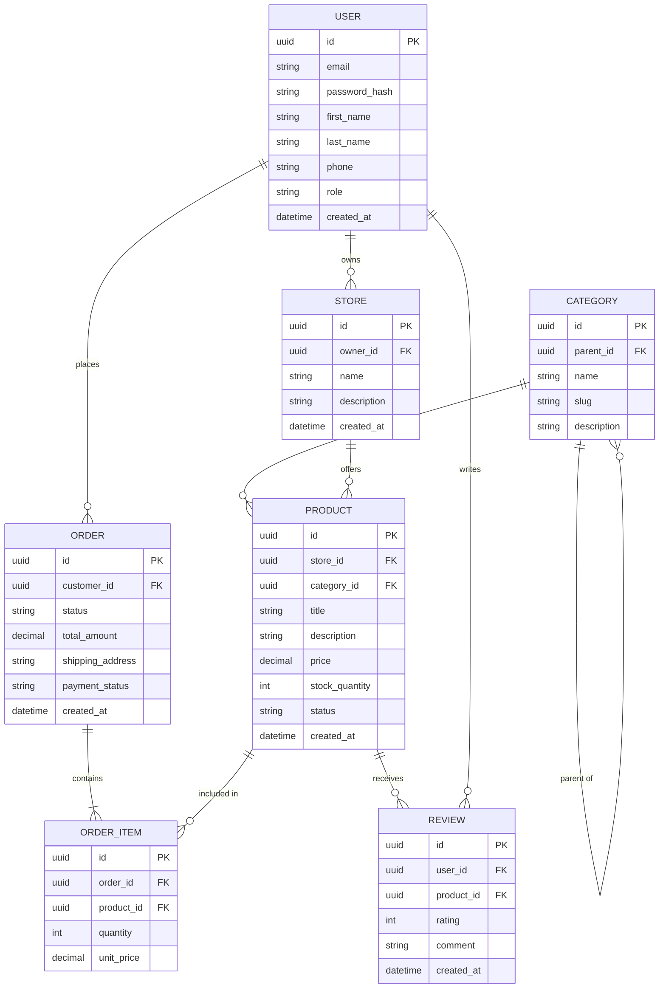

# Журнал взаємодії з AI (Prompt History)

## Ітерація 1: Базовий драфт
**Промт:**
> "Мені потрібно спроєктувати ER-модель бази даних для маркетплейсу. Зроби базову структуру: користувачі (покупці та продавці), товари, категорії, замовлення, позиції замовлення та відгуки. Опиши сутності, атрибути та зв'язки у синтаксисі Mermaid erDiagram."

**Отриманий результат:**

---

## Ітерація 2: Інженерний аудит та Spec-First виправлення
**Промт / Фідбек:**
> "Я провів аудит моделі:
> 1. Видалити надлишкове обчислюване поле subtotal із ORDER_ITEMS та rating зі STORES (дотримання 3NF).
> 2. Зафіксувати назви сутностей в однині (USER, STORE, PRODUCT, ORDER, CATEGORY, ORDER_ITEM, REVIEW).
> 3. Замінити типи text на string, timestamp на datetime, прибрати нестандартні модифікатори UK.
> 4. Додати чіткі критерії прийняття (Acceptance Criteria) у spec.md та зафіксувати unit_price для історії цін.
> Онови ER-модель згідно з цими правилами."

**Отриманий результат:**
